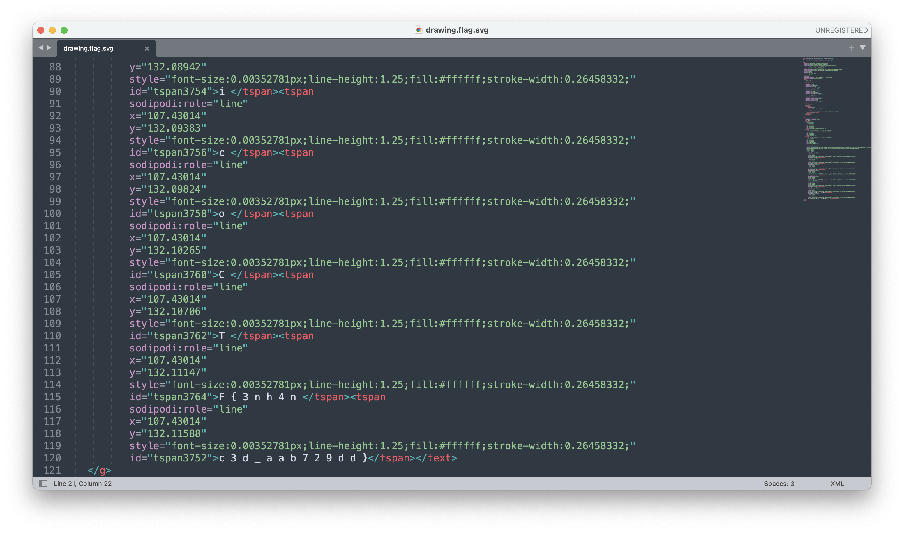

# picoCTF - Enhance!

# Description

Download this image file and find the flag.

- [Download image file](https://artifacts.picoctf.net/c/100/drawing.flag.svg)

# Solution

下載後為一個svg，先點開來看看

圖片上可以正常開啟，檔案格式沒有問題。圖片上沒有透露什麼資訊。因為svg是用XML語法畫圖的，將他以文字編輯的方式打開來看看，立刻就找到flag了，這題只是將flag藏在id裡而已。

# Flag

picoCTF{3nh4nc3d_aab729dd}