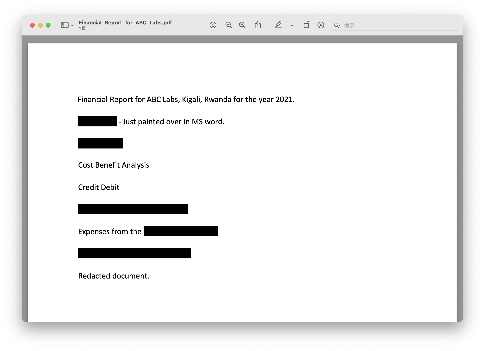

# picoCTF - Redaction gone wrong

# Description

Now you DON’T see me.This [report](https://artifacts.picoctf.net/c/84/Financial_Report_for_ABC_Labs.pdf) has some critical data in it, some of which have been redacted correctly, while some were not. Can you find an important key that was not redacted properly?

# **Solution**

題目給了一支pdf，裏面有一些被黑色槓掉的文字無法看見，複製全文後去記事本貼上就可以看到flag了，這題也很簡單。

# Flag

picoCTF{C4n_Y0u_S33_m3_fully}