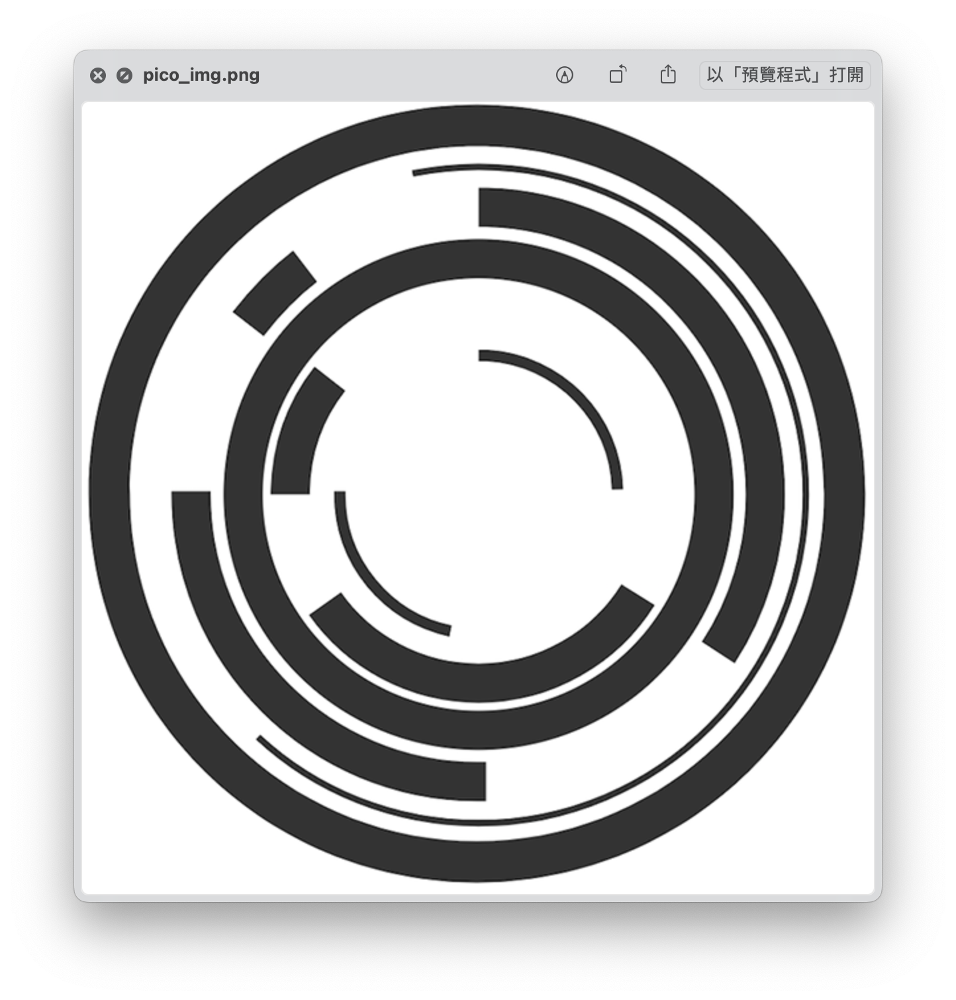
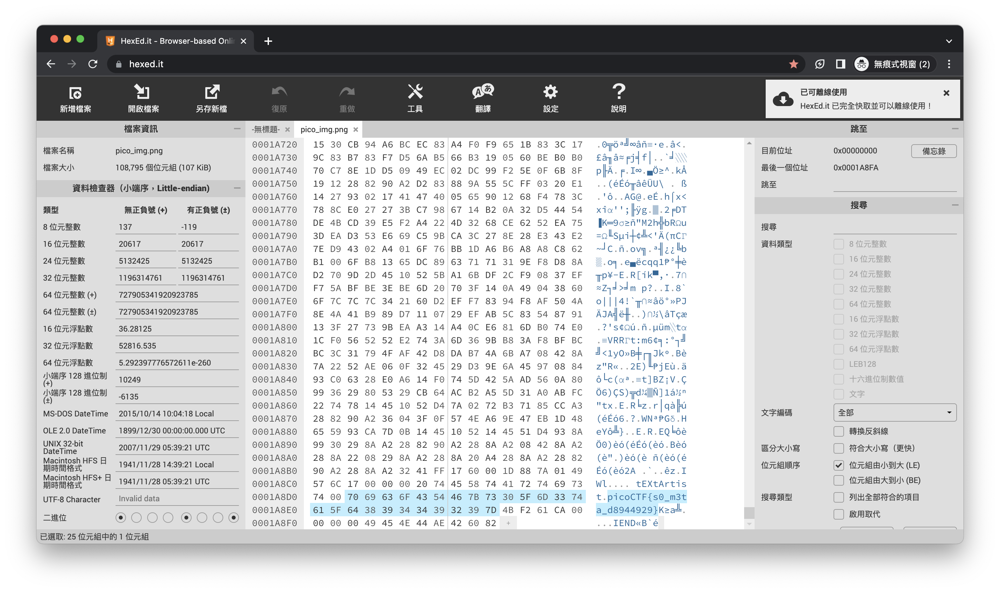

# picoCTF - So Meta

# Description

Find the flag in this [picture](https://jupiter.challenges.picoctf.org/static/916b07b4c87062c165ace1d3d31ef655/pico_img.png).

# Hints

1. What does meta mean in the context of files?
2. Ever heard of metadata?

# Solution

題目給的是一張圖片，圖片上沒有什麼資訊

使用[HexEd.it](https://hexed.it/)看一下他的檔案內容，結果翻到最下面就可以看到flag了，秒殺～

# Flag

picoCTF{s0_m3ta_d8944929}