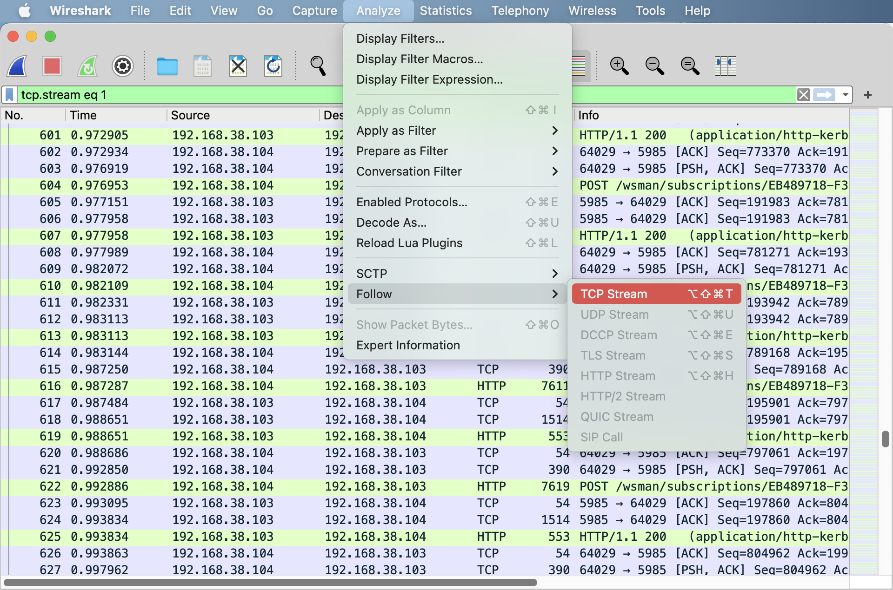
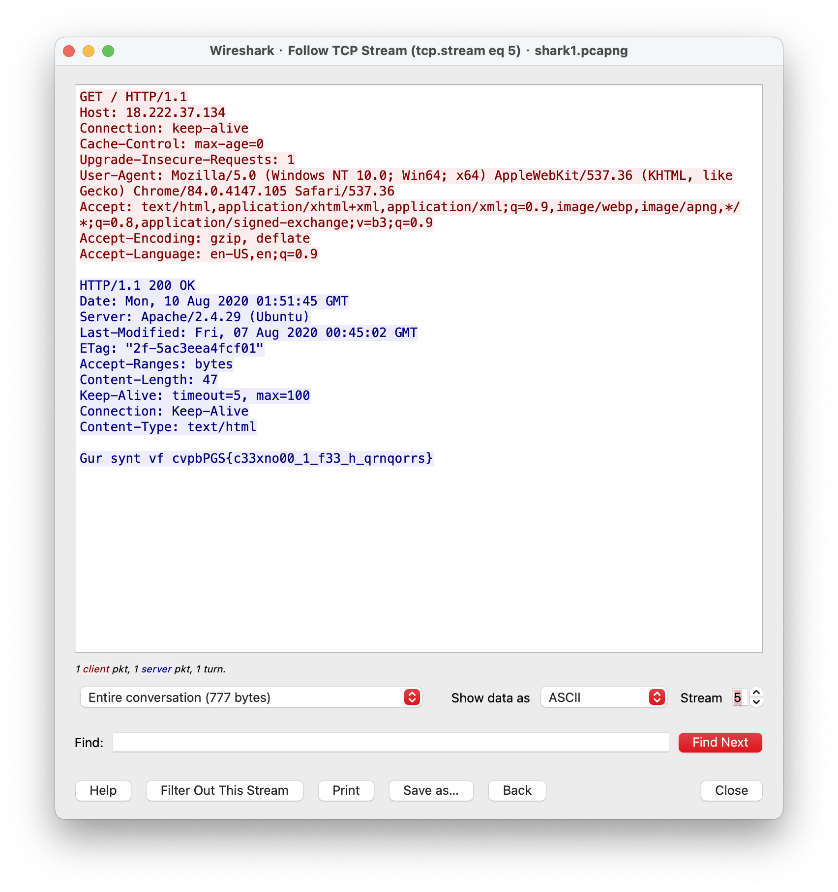
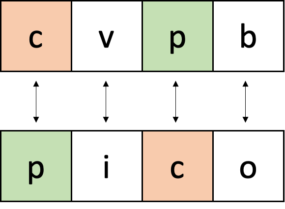

# picoCTF - Wireshark doo dooo do doo...

# Description

Can you find the flag? [shark1.pcapng](https://mercury.picoctf.net/static/b44842413a0834f4a3619e5f5e629d05/shark1.pcapng).

# **Solution**

這次練習的[題目](https://www.notion.so/picoCTF-Wireshark-doo-dooo-do-doo-0cfd084c14974df6a65f5b403ac4f5b6?pvs=21)只給了一包Pcap檔，把它丟進[WireShark](https://www.wireshark.org/)看看。大部分都是 TCP 跟 HTTP 協定的封包來回，先使用分析工具(Analyze→Follow→TCP Stream)查看一下傳送的內容。

<aside>
💡 Follow Stream 的功能可以依序追蹤封包所傳送的內容，將有關聯性的封包合併呈現，使用者可以更方便解讀封包的內容訊息
</aside>

隨意檢查一下，在第五個TCP Stream看到一組GET Method，Response中也有回傳一串亂碼：
`Gur synt vf cvpbPGS{c33xno00_1_f33_h_qrnqorrs}`

pico的flag格式就是：picoCTF{flag}，所以可以猜測這串亂碼可能是flag，而且是用無法轉換大括號的方式加密，再來注意到亂碼cvpb的c對應到明碼pico的p；而p則是對應到c，那應該是透過替換式加密法 ROT13 加密

使用[加解密工具](https://gchq.github.io/CyberChef/)就可以看到flag了

# Flag

picoCTF{p33kab00_1_s33_u_deadbeef}