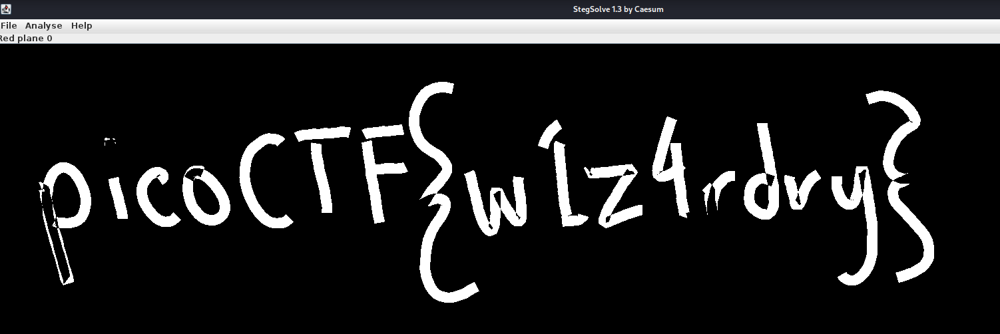
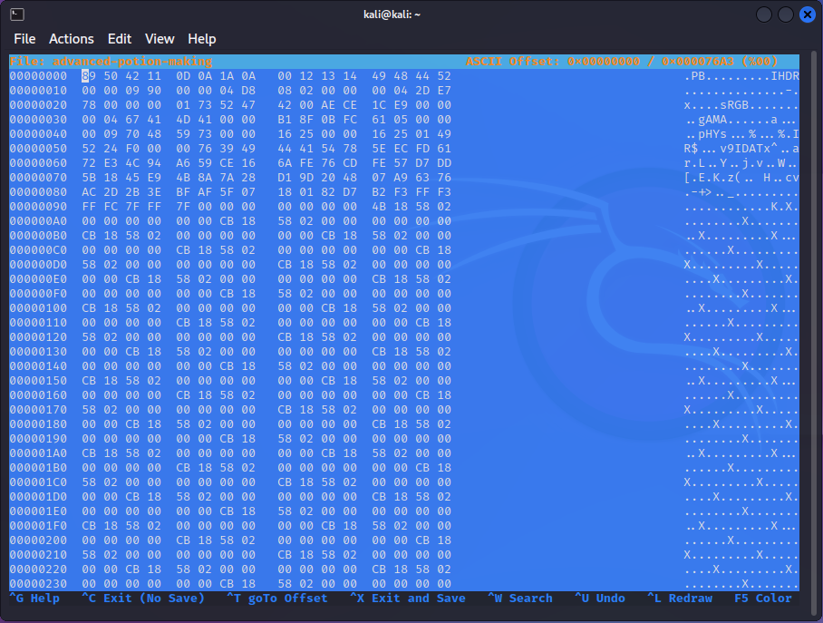

# picoCTF - advanced-potion-making

# Description

Ron just found his own copy of advanced potion making, but its been corrupted by some kind of spell. Help him recover it!

# CHALLENGE ENDPOINTS

[advanced-potion-making](https://artifacts.picoctf.net/picoMini+by+redpwn/Forensics/advanced-potion-making/advanced-potion-making)

# **Solution**

檔案沒有附檔名，試著直接加上png，jpg，gif，txt，都沒有辦法打開。用**hexeditor**查看一下內容**。**

開頭有點眼熟，找了一下，可能是PNG的格式（PNG開頭固定為 89 50 4E 47 0D 0A 1A 0A）。將`0x00000002`跟`0x00000003`修改為`4E`跟`47`，再將`0x00000009` 到 `0x0000000B`改為`00 00 0D`（這都是PNG的固定格式，未來再發一篇介紹PNG格式的），另存新檔並加上附檔名.png。

結果拿到的是整張紅。

這邊卡超久的，我不知道我可能忽略了甚麼。最後上網找別人的答案才明白原來是[隱寫術](https://en.wikipedia.org/wiki/Steganography)的技巧，只要使用工具**stegsolve**轉換就好了，結果如下。（有空也要了解一下這個工具的每個作法才行）

# Flag

picoCTF{w1z4rdry}