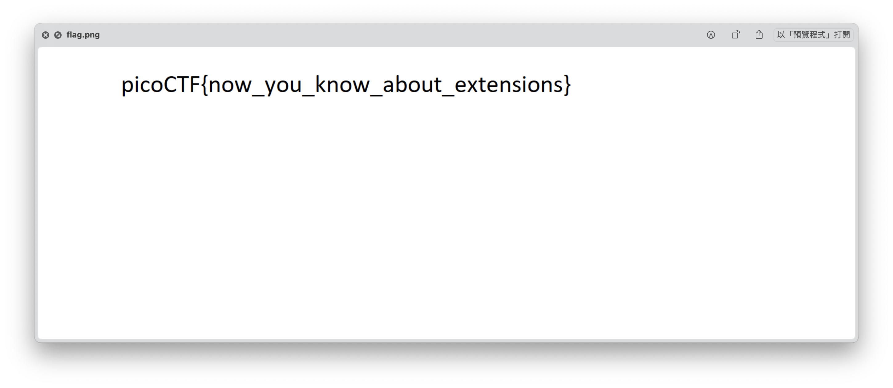

# picoCTF - extensions

# Description

This is a really weird text file [TXT](https://jupiter.challenges.picoctf.org/static/e7e5d188621ee705ceeb0452525412ef/flag.txt)? Can you find the flag?

# Hints

1. How do operating systems know what kind of file it is? (It's not just the ending!
2. Make sure to submit the flag as picoCTF{XXXXX}

# Solution

題目給了一個txt，但是無法打開來看，使用[HexEd.it](https://hexed.it/)看一下他的檔案內容。很明顯是一個png檔（png 的開頭固定為 0x89, 0x50, 0x4E, 0x47, 0x0D, 0x0A, 0x1A, 0x0A），就重新命名副檔名為png就可以看到圖案，而圖案上就是flag了～

# Flag

picoCTF{now_you_know_about_extensions}