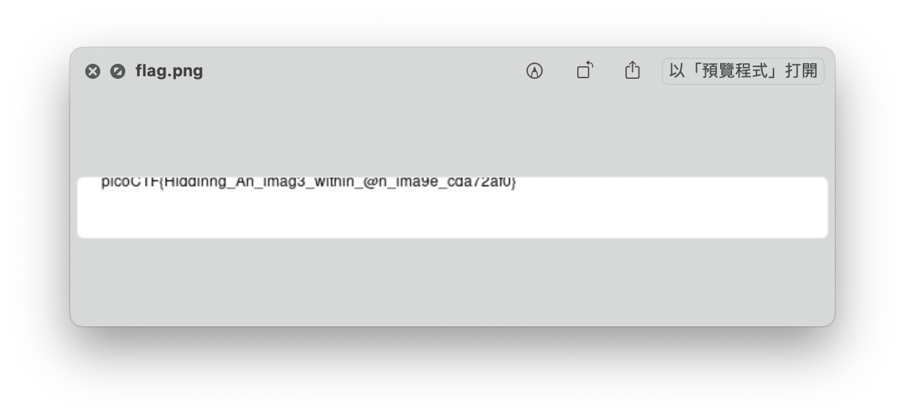

# picoCTF - hideme

# Description

Every file gets a flag.The SOC analyst saw one image been sent back and forth between two people. They decided to investigate and found out that there was more than what meets the eye [here](https://artifacts.picoctf.net/c/259/flag.png).

# Solution

一開始給的是一張圖片.png，用[HexEd.it](https://hexed.it/)打開來看看，先搜尋.png的結尾IEND，找到在那之後還有PK（通常是壓縮檔的意思）。


接下來用[BinWalk](https://github.com/ReFirmLabs/binwalk)看能不能將圖片裡的額外檔案都截出來

```bash
binwalk -Me flag.png
```

解出來的資料夾中有一個”secret”的資料夾，裡面的圖片就是flag了～～



# Flag

picoCTF{Hiddinng_An_imag3_within_@n_ima9e_cda72af0}