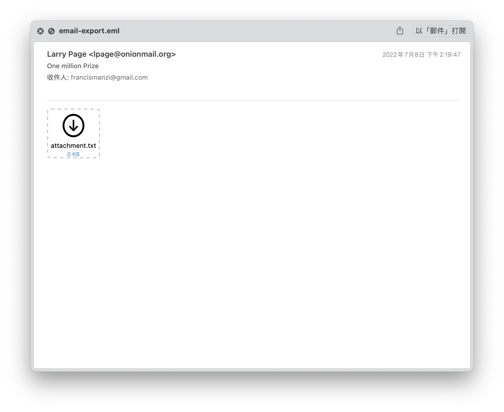
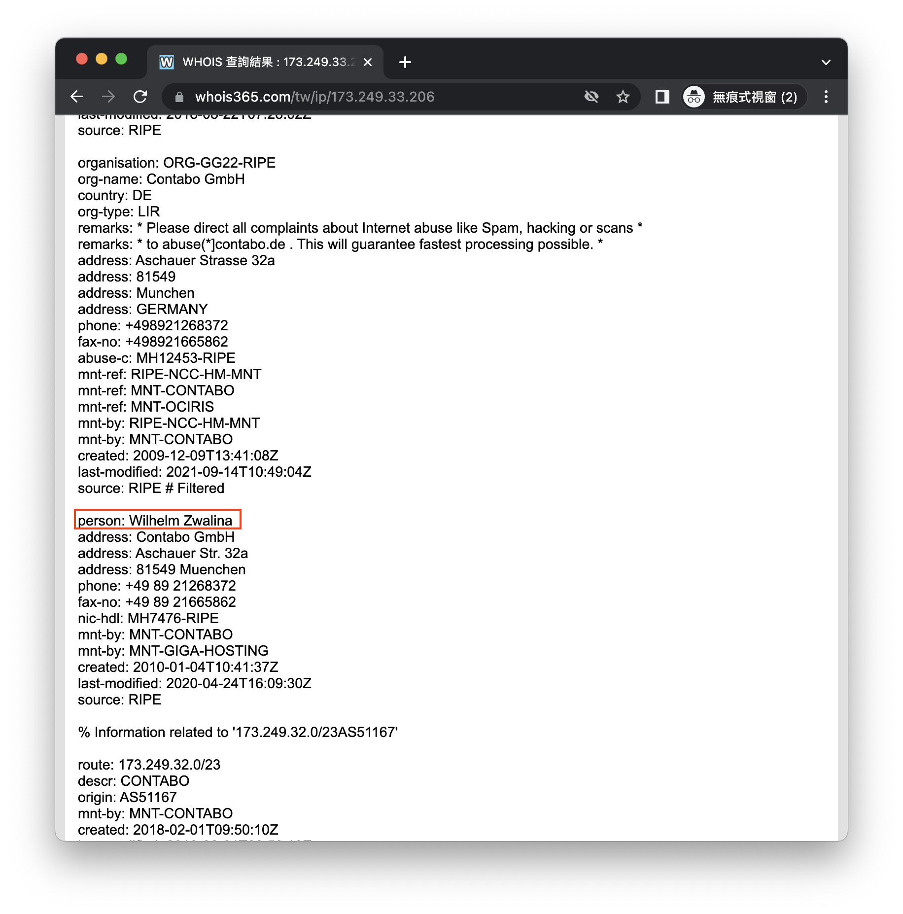

# picoCTF - who is it

# Description

Someone just sent you an email claiming to be Google's co-founder Larry Page but you suspect a scam.Can you help us identify whose mail server the email actually originated from?Download the email file [here](https://artifacts.picoctf.net/c/499/email-export.eml). 

Flag: picoCTF{FirstnameLastname}

# Hints

whois can be helpful on IP addresses also, not only domain names.

# **Solution**

題目給的為郵件檔，題目說flag為真實寄件人的姓名，很明顯不是Larry Page。

那將信件的原始碼打開來看看，用關鍵字搜尋**From**找找看有沒有更多寄件人的資訊，其中有找到一組ip為173.249.33.206，搭配提示給的資訊，我們用whois查查看這組ip，並找到該ip的擁有者，
他的名字就是flag啦～

# Flag

picoCTF{WilhelmZwalina}