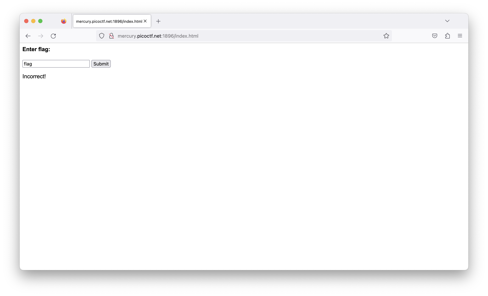
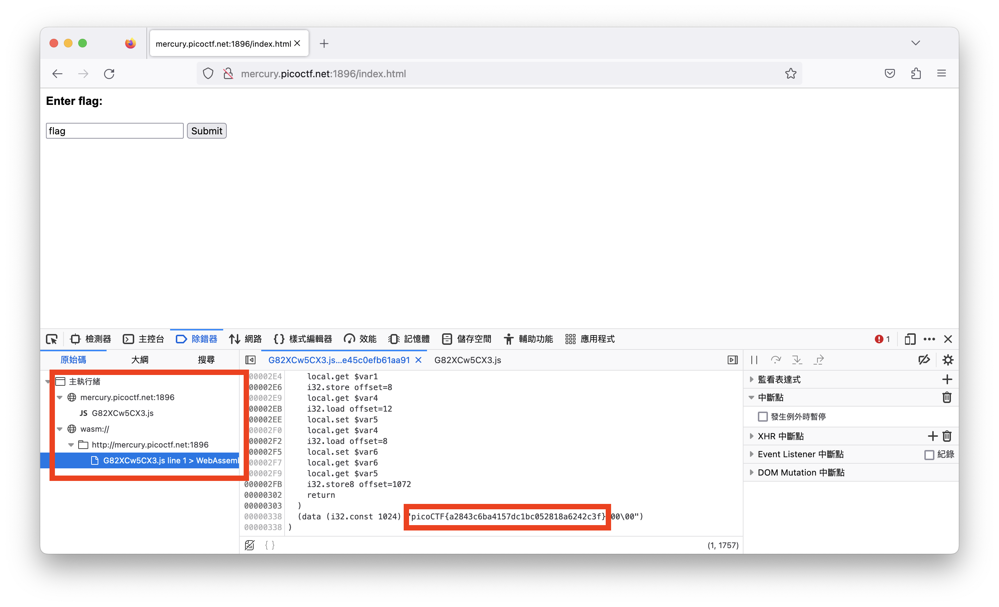
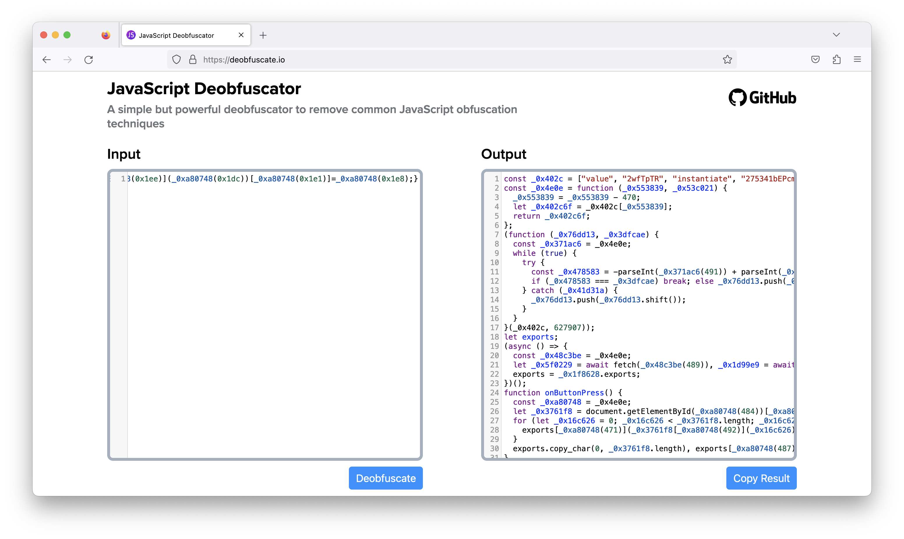

# picoCTF - Some Assembly Required 1

# Description

[http://mercury.picoctf.net:1896/index.html](http://mercury.picoctf.net:1896/index.html)

# **Solution**

題目沒有給任何提示，連上去網站後有一個input可以輸入，試過一些組合。都沒用 🥲



用開發人員工具看看這個頁面的原始碼跟載入的檔案，其中有載入一個JS，JS又有呼叫另一個檔案。JS有用[obfuscator](https://zh.wikipedia.org/zh-tw/%E4%BB%A3%E7%A0%81%E6%B7%B7%E6%B7%86)處理，很難閱讀。另一個檔案為明文，結果拉到最下面就看到Flag了…



這題原本的設計應該是要解開js來尋找flag的，但現在開發工具太方便了，可以直接看到JS另外載入的檔案。不過還是試著解開JS看看。

先將JS的程式碼用[Deobfuscator](https://deobfuscate.io/)工具自動整理：



```jsx
'use strict';
const _0x402c = ["value", "2wfTpTR", "instantiate", "275341bEPcme", "innerHTML", "1195047NznhZg", "1qfevql", "input", "1699808QuoWhA", "Correct!", "check_flag", "Incorrect!", "./JIFxzHyW8W", "23SMpAuA", "802698XOMSrr", "charCodeAt", "474547vVoGDO", "getElementById", "instance", "copy_char", "43591XxcWUl", "504454llVtzW", "arrayBuffer", "2NIQmVj", "result"];

const _0x4e0e = function(url, whensCollection) {
  /** @type {number} */
  url = url - 470;
  let _0x402c6f = _0x402c[url];
  return _0x402c6f;
};

(function(data, oldPassword) {
  const toMonths = _0x4e0e;
  for (; !![];) {
    try {
      const userPsd = -parseInt(toMonths(491)) + parseInt(toMonths(493)) + -parseInt(toMonths(475)) * -parseInt(toMonths(473)) + -parseInt(toMonths(482)) * -parseInt(toMonths(483)) + -parseInt(toMonths(478)) * parseInt(toMonths(480)) + parseInt(toMonths(472)) * parseInt(toMonths(490)) + -parseInt(toMonths(485));
      if (userPsd === oldPassword) {
        break;
      } else {
        data["push"](data["shift"]());
      }
    } catch (_0x41d31a) {
      data["push"](data["shift"]());
    }
  }
})(_0x402c, 627907);

let exports;
(async() => {
  const findMiddlePosition = _0x4e0e;
  let leftBranch = await fetch(findMiddlePosition(489));
  let rightBranch = await WebAssembly[findMiddlePosition(479)](await leftBranch[findMiddlePosition(474)]());
  let module = rightBranch[findMiddlePosition(470)];
  exports = module["exports"];
})();

/**
 * @return {undefined}
 */
function onButtonPress() {
  const navigatePop = _0x4e0e;
  let params = document["getElementById"](navigatePop(484))[navigatePop(477)];
  for (let i = 0; i < params["length"]; i++) {
    exports[navigatePop(471)](params[navigatePop(492)](i), i);
  }
  exports["copy_char"](0, params["length"]);
  if (exports[navigatePop(487)]() == 1) {
    document[navigatePop(494)](navigatePop(476))[navigatePop(481)] = navigatePop(486);
  } else {
    document[navigatePop(494)](navigatePop(476))[navigatePop(481)] = navigatePop(488);
  }
}
;
```

首先開頭為一個陣列，看裡面存放的值應該就是各種值，降低程式碼易讀性用的，我將它重新命名為`vals`。

第一個function `_0x4e0e`將參數減掉`470`後就去`vals`取值，第二個參數沒有用，這邊也將變數重新命名一下：

```jsx
const vals = ["value", "2wfTpTR", "instantiate", "275341bEPcme", "innerHTML", "1195047NznhZg", "1qfevql", "input", "1699808QuoWhA", "Correct!", "check_flag", "Incorrect!", "./JIFxzHyW8W", "23SMpAuA", "802698XOMSrr", "charCodeAt", "474547vVoGDO", "getElementById", "instance", "copy_char", "43591XxcWUl", "504454llVtzW", "arrayBuffer", "2NIQmVj", "result"];

const getVal = function(index, nothing) {
  /** @type {number} */
  index = index - 470;
  let val = vals[index];
  return val;
};
```

第二個function是一個無窮迴圈，當`userPsd`的值等於`627907`的時候才會跳出迴圈，toMonths也是指向`vals`陣列，迴圈裡做的事情就是把`vals`裡的第一個值放到最後一個而已。將code重新命名整理

```jsx
(function(data, con) {
  const function2getVal = getVal;
  for (; !![];) {
    try {
      const calnum = -parseInt(function2getVal(491)) + parseInt(function2getVal(493)) + -parseInt(function2getVal(475)) * -parseInt(function2getVal(473)) + -parseInt(function2getVal(482)) * -parseInt(function2getVal(483)) + -parseInt(function2getVal(478)) * parseInt(function2getVal(480)) + parseInt(function2getVal(472)) * parseInt(function2getVal(490)) + -parseInt(function2getVal(485));
      if (calnum === condition) {
        break;
      } else {
        data["push"](data["shift"]());
      }
    } catch (_0x41d31a) {
      data["push"](data["shift"]());
    }
  }
})(vals, 627907);
```

這邊跑完後，我們也會拿到新的`vals`：

```jsx
00. "instance",
01. "copy_char",
02. "43591XxcWUl",
03. "504454llVtzW",
04. "arrayBuffer",
05. "2NIQmVj",
06. "result",
07. "value",
08. "2wfTpTR",
09. "instantiate",
10. "275341bEPcme",
11. "innerHTML",
12. "1195047NznhZg",
13. "1qfevql",
14. "input",
15. "1699808QuoWhA",
16. "Correct!",
17. "check_flag",
18. "Incorrect!",
19. "./JIFxzHyW8W",
20. "23SMpAuA",
21. "802698XOMSrr",
22. "charCodeAt",
23. "474547vVoGDO",
24. "getElementById"
```

那下面的程式碼就可以發現`await fetch`是去跟`"./JIFxzHyW8W”`要資料，該網址就可以撈到flag了。

（原本想繼續解析`JIFxzHyW8W`裡的內容的但WebAssembly實在還不會…未來有機會再來補上）

# Flag

picoCTF{a2843c6ba4157dc1bc052818a6242c3f}