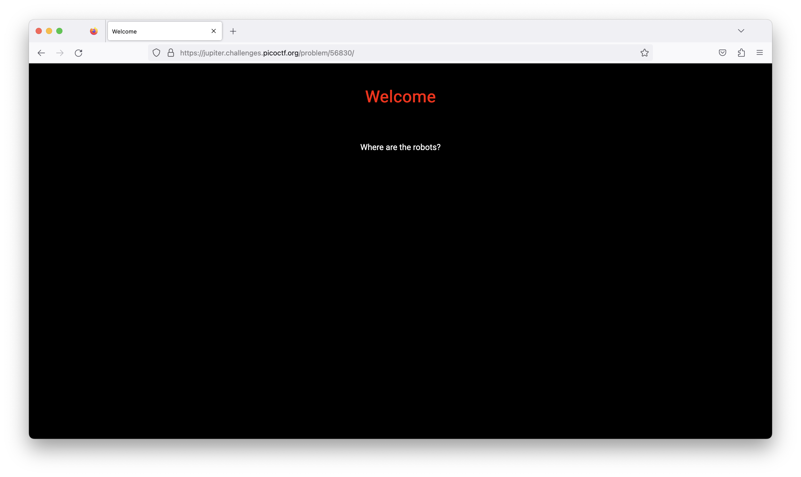
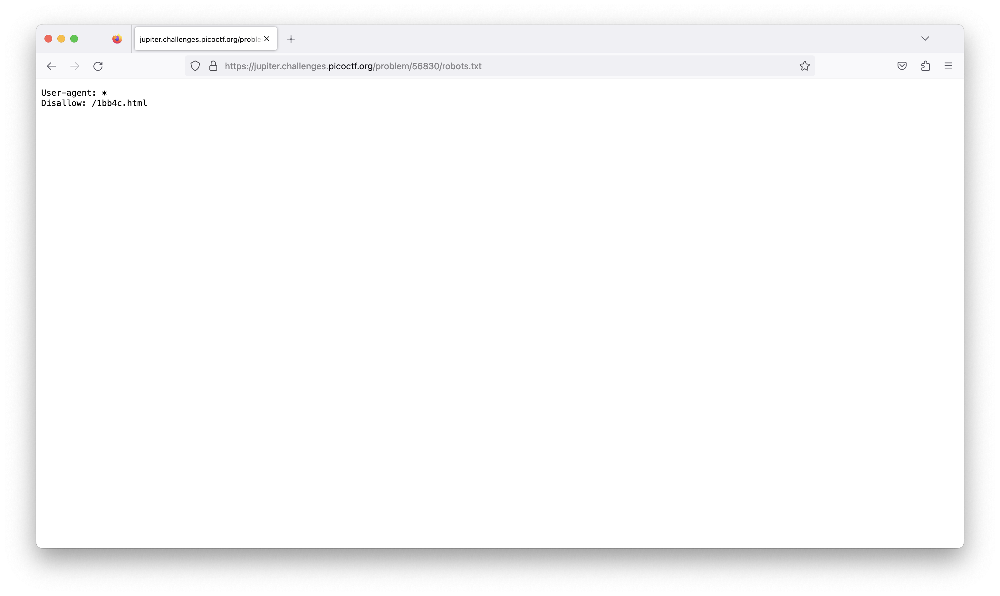
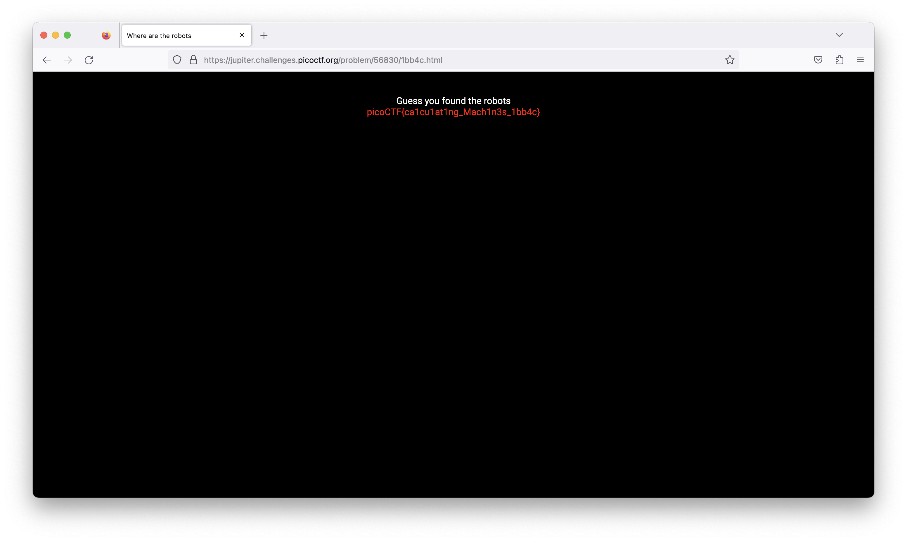

# picoCTF - where are the robots

# Description

Can you find the robots? [https://jupiter.challenges.picoctf.org/problem/56830/](https://jupiter.challenges.picoctf.org/problem/56830/) or [http://jupiter.challenges.picoctf.org:56830](http://jupiter.challenges.picoctf.org:56830)

# Hints

What part of the website could tell you where the creator doesn't want you to look?

# **Solution**

進來就是一個網頁，其實題目給的提示太明顯了，就是要我們找robots.txt這個檔案。

<aside>
💡 robots.txt是一個存在網站根目錄下的檔案，搜尋引擎跟爬蟲機器人會自動略過robot.txt所記錄的位置。
</aside>

在根目錄直接加上檔案名稱就可以看到這個文件了，那文件裡有一個不允許爬蟲的連結為/1bb4c.html，連上去看看。

樣就找到了！

# Flag

picoCTF{ca1cu1at1ng_Mach1n3s_1bb4c}